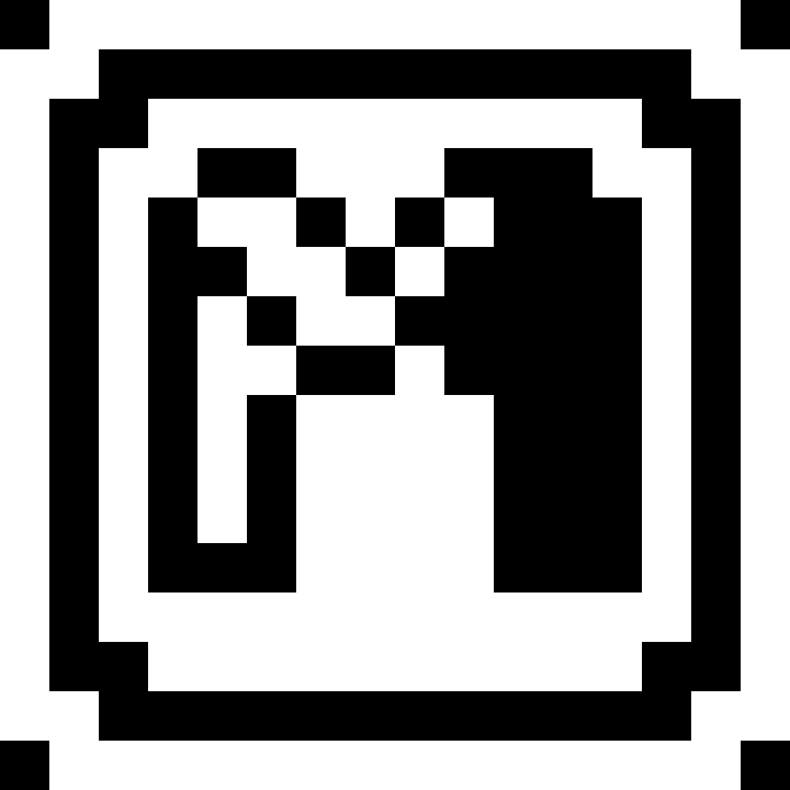

# Mini Sprite

[![style: very good analysis][very_good_analysis_badge]][very_good_analysis_link]
[![License: MIT][license_badge]][license_link]

Mini sprite is a simple, matrix based format for creating 1bit styled graphics.

[license_badge]: https://img.shields.io/badge/license-MIT-blue.svg
[license_link]: https://opensource.org/licenses/MIT
[very_good_analysis_badge]: https://img.shields.io/badge/style-very_good_analysis-B22C89.svg
[very_good_analysis_link]: https://pub.dev/packages/very_good_analysis

## Project structure

Mini Sprite is composed by several projects:

### [Mini Sprite](packages/mini_sprite)

The core of the it contains the engine/platform agnostic core code to handle the format for the
sprites and maps.

### [Mini Sprite Editor](packages/mini_sprite_editor)

The flutter application deployed at [https://minisprit.es](https://minisprit.es) which is used to design sprites and
maps using Mini Sprite's format.

### [Flame Mini Sprite](packages/flame_mini_sprite)

Provides bridge methods to make it easier to use Mini Sprite inside the
[flame game engine](https://flame-engine.org).

### [Mini Treasure Quest](packages/mini_treasure_quest)

An example game made with Flame and Mini Sprite.

### Get help

Check each provide listed above to read the documentation of each package.

Join Bluefire's [discord server](https://discord.gg/pxrBmy4) to ask question to the team and the community.
